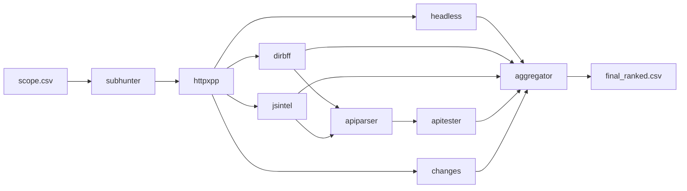

# 🏗️ Architecture BB-Pipeline

> Architecture technique détaillée du framework BB-Pipeline

## Vue d'ensemble

BB-Pipeline est conçu comme un **framework modulaire** avec une architecture **pipeline-oriented** où chaque module transforme des données CSV en entrée vers des données CSV en sortie enrichies.



## Principes architecturaux

### 1. **Modularité stricte**
- Chaque module = binaire C++ indépendant
- Interfaces standardisées (CSV in → CSV out)
- Pas de dépendances entre modules
- Remplacement/mise à jour facile

### 2. **Contrats de données**
- Schémas CSV versionnés (`schema_ver=1`)
- Validation stricte des entrées/sorties
- Évolution compatible des formats

### 3. **Safe-by-default**
- Validation du scope à chaque étape
- Rate limiting configuré par programme
- Pas d'actions destructrices
- Logs auditables (NDJSON)

### 4. **Observabilité**
- Correlation IDs pour traçabilité
- Métriques de performance intégrées
- Rapports détaillés par module

## Architecture du code

### Structure des répertoires

```
bb-pipeline/
├── src/core/           # Bibliothèques partagées
│   ├── config.cpp      # Configuration YAML
│   ├── csv.cpp         # Parser/Writer CSV
│   ├── logger.cpp      # Logging NDJSON
│   ├── rate_limit.cpp  # Token bucket
│   ├── scope.cpp       # Validation scope
│   ├── http.cpp        # Client HTTP/cURL
│   └── ...
├── src/modules/        # Modules de reconnaissance
│   ├── subhunter/      # Énumération DNS
│   ├── httpxpp/        # Probing HTTP
│   ├── dirbff/         # Directory fuzzing
│   └── ...
├── include/bbp/        # Headers C++
└── src/bbpctl/         # Orchestrateur
```

### Hiérarchie des dépendances

```
bbpctl (orchestrateur)
    └── libbbp-core (bibliothèques partagées)
    
bbp-subhunter (module)
    └── libbbp-core
    
bbp-httpxpp (module)  
    └── libbbp-core
    
... (tous les modules)
```

## Modules détaillés

### Core Libraries

#### `config.cpp` - Configuration YAML
- Chargement des fichiers `configs/*.yaml`
- Validation des paramètres
- Overrides par variable d'environnement
- Hot-reload pour développement

#### `csv.cpp` - Gestion CSV
- Parser robuste avec validation de schéma
- Writer avec buffering optimisé
- Support des types complexes (JSON, arrays)
- Gestion des erreurs et récupération

#### `rate_limit.cpp` - Rate Limiting
- Algorithme Token Bucket
- Configuration par programme/domaine
- Backoff exponentiel sur erreurs
- Métriques temps réel

#### `scope.cpp` - Validation Scope
- Parser du fichier `scope.csv`
- Validation domaine/sous-domaine
- Vérification des permissions (API, mobile)
- Cache des résultats de validation

#### `http.cpp` - Client HTTP
- Wrapper autour de libcurl
- Pool de connexions réutilisables
- Support HTTP/2, TLS 1.3
- Headers et auth configurables
- Retry automatique avec backoff

### Modules de reconnaissance

#### M1: `subhunter` - Énumération DNS
**Entrée**: `scope.csv`
**Sortie**: `01_subdomains.csv`

```cpp
class SubdomainEnumerator {
    std::vector<Subdomain> enumerate(const Scope& scope);
    std::vector<Subdomain> passive_enum();  // Certificate Transparency
    std::vector<Subdomain> active_enum();   // DNS bruteforce
    std::vector<Subdomain> wrapper_enum();  // subfinder/amass
};
```

#### M2: `httpxpp` - Probing HTTP  
**Entrée**: `01_subdomains.csv`
**Sortie**: `02_probe.csv`

```cpp
class HttpProber {
    ProbeResult probe(const std::string& url);
    TechStack detect_technologies(const HttpResponse& response);
    std::string extract_title(const std::string& html);
    SecurityHeaders analyze_headers(const HttpResponse& response);
};
```

#### M4: `dirbff` - Directory Discovery
**Entrée**: `02_probe.csv`  
**Sortie**: `04_discovery.csv`

```cpp
class DirectoryBruteforcer {
    std::vector<DiscoveredPath> bruteforce(const std::string& base_url);
    bool is_soft_404(const HttpResponse& response);
    PathCategory categorize_path(const std::string& path);
};
```

## Orchestrateur (`bbpctl`)

### Architecture de l'orchestrateur

```cpp
class PipelineOrchestrator {
private:
    Configuration config_;
    std::vector<std::unique_ptr<PipelineModule>> modules_;
    std::shared_ptr<MetricsCollector> metrics_;
    
public:
    ExecutionPlan create_plan(const Scope& scope);
    ExecutionResult execute_plan(const ExecutionPlan& plan);
    void resume_execution(const std::string& checkpoint_file);
};

class PipelineModule {
public:
    virtual std::string name() const = 0;
    virtual std::vector<std::string> dependencies() const = 0;
    virtual ExecutionResult execute(const ModuleInput& input) = 0;
    virtual bool can_skip(const ModuleInput& input) const = 0;
};
```

### Stratégies d'exécution

1. **Séquentiel** - Un module après l'autre
2. **Pipeline** - Modules parallèles sans dépendances
3. **Adaptive** - Ajustement dynamique selon la charge

### Gestion d'état

```cpp
struct ExecutionState {
    std::string correlation_id;
    std::chrono::timestamp start_time;
    std::map<std::string, ModuleState> module_states;
    std::vector<std::string> completed_modules;
    std::optional<std::string> current_module;
    bool can_resume;
};
```

## Gestion des erreurs

### Hiérarchie d'exceptions

```cpp
class BBPipelineException : public std::exception {};
class ConfigurationError : public BBPipelineException {};
class ScopeViolation : public BBPipelineException {};
class RateLimitExceeded : public BBPipelineException {};
class NetworkError : public BBPipelineException {};
class ParseError : public BBPipelineException {};
```

### Stratégies de récupération

1. **Retry avec backoff** - Erreurs transitoires réseau
2. **Skip et continue** - Erreurs sur domaines spécifiques  
3. **Graceful degradation** - Fonctionnalités optionnelles
4. **Fail-fast** - Erreurs critiques (scope, config)

## Performance et optimisations

### Parallélisation

```cpp
class ThreadPool {
    void submit(std::function<void()> task);
    std::future<T> submit(std::function<T()> task);
    void wait_all();
    void set_max_threads(size_t count);
};
```

### Cache et persistance

- **HTTP Cache**: ETag/Last-Modified
- **DNS Cache**: TTL respecté, invalidation intelligente  
- **Results Cache**: CSV intermédiaires pour resume
- **Configuration Cache**: Hot-reload sans redémarrage

### Métriques temps réel

```cpp
struct PipelineMetrics {
    size_t total_domains;
    size_t completed_domains;
    std::chrono::duration<double> elapsed_time;
    double requests_per_second;
    std::map<std::string, ModuleMetrics> module_metrics;
};
```

## Sécurité

### Isolation

- Chaque module = processus séparé
- Communication via files et pipes
- Pas de mémoire partagée
- Sandbox possible avec namespaces/containers

### Audit trail

```json
{
  "timestamp": "2025-01-15T10:30:00Z",
  "correlation_id": "bbp_abc123",
  "module": "httpxpp", 
  "action": "http_request",
  "target": "api.example.com",
  "method": "GET", 
  "status": 200,
  "scope_validated": true,
  "rate_limit_ok": true
}
```

### Conformité

- Respect strict du scope (validation multi-niveaux)
- Rate limiting par programme avec override impossible
- Logs non-répudiables avec signatures
- Mode dry-run pour validation

## Extensibilité

### Plugin system (futur)

```cpp
class ModulePlugin {
public:
    virtual std::string name() const = 0;
    virtual std::string version() const = 0;
    virtual std::vector<std::string> input_schemas() const = 0;
    virtual std::string output_schema() const = 0;
    virtual void initialize(const Configuration& config) = 0;
    virtual ExecutionResult process(const CSVData& input) = 0;
};
```

### API REST (futur)

```
GET    /api/v1/pipelines/{id}/status
POST   /api/v1/pipelines
DELETE /api/v1/pipelines/{id}
GET    /api/v1/pipelines/{id}/results
```

Cette architecture garantit **scalabilité**, **maintenabilité**, et **sécurité** tout en restant simple à comprendre et étendre.